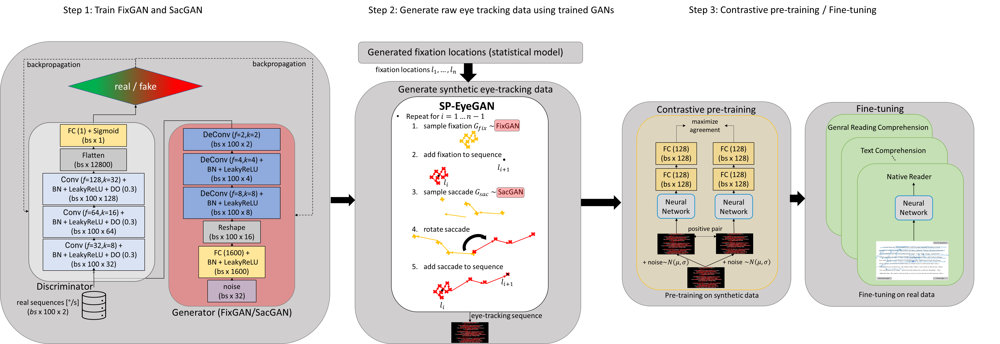

SP-EyeGAN: Generating Synthetic Eye Movement Data
=================================================

This repository provides the code for reproducing the experiments in SP-EyeGAN: Generating Synthetic Eye Movement Data. Additionally, you can also use the pre-trained models and create the synthetic data you need for your experiments.



## Reproduce tables and figures from the paper
To reproduce all the tables and figures from the paper you can run the following notebooks:
* Run/inspect notebook [this notebook](reproduce_tables_2_3.ipynb) to reproduce Tables 2 and 3 comparing the quality of generated fixations and saccades.
* Run/inspect notebook [this notebook](reproduce_figure_3.ipynb) to reproduce Figure 3 showing eye movements generated with SP-EyeGAN on a text.
* Run/inspect notebook [this notebook](reproduce_downstream_tables_4_5_6_7_8_figure_5.ipynb) to reproduce Tables 4-8 and Figure 5 comparing methods on downstream tasks.

## Reproduce the experiments

### Hardware and time requirements
* RAM: 12 GB to store the training data to train FixGAN and SacGAN
* GPU-RAM: 12 GB (we trained the models using a A100-SXM4-40GB
* time to train SP-EyeGAN: approx 20 min to train FixGAN and 5 min to train SacGAN on a A100-SXM4-40GB

### Get data for downstream task (ADHD)
Clone the github repository to obtain the ADHD dataset:
* Using git(hub)s CLI and ssh:
    * `git clone git@github.com:aeye-lab/sp-eyegan`
* without ssh:
    * `git clone https://github.com/aeye-lab/sp-eyegan`
* if you do not use the terminal / git bash / ide you can download the zip file at the top right of the [repository](https://github.com/aeye-lab/sp-eyegan). Extract the zip file after downloading it.

### Rerun all experiments

We provide a ssh script which lets you rerun all experiments. We assume that you will have activate a virtual or conda environment, or work with a global pip installation.
```bash
rerun_experiments.sh
```

If you do not to replicate all experiments, you can either choose to comment out certain parts of the `rerun_experiments.sh` or other bash scripts or follow the steps provided below. Depending on your hardware rerunning all experiments might take several days.


### Download data

We use the [`pymovements`](https://github.com/aeye-lab/pymovements) package to download the data. For this either execute `scripts/get_data.sh` or it is also part of the `rerun_experiments.sh` script.


Alternatively, you can also download the data from the sources listed below.

Download the GazeBase data:
* Download and extract the GazeBase data into a `data/GazeBase` to train FixGAN and SacGAN [figshare-link](https://figshare.com/articles/dataset/GazeBase_Data_Repository/12912257).

Download the JuDo1000 data:
* Download and extract the JuDo1000 data from this [osf-link](https://osf.io/5zpvk/).

Download the SB-SAT data:
* Download the SB-SAT data into a `data/SB-SAT` [osf-link](https://osf.io/cdx69/).

Clone the github repository to obtain the ADHD dataset into `data/ecml-ADHD`:
* Using git(hub)s CLI and ssh:
    * `git clone git@github.com:aeye-lab/ecml-ADHD data/ecml-ADHD`
* without ssh.:
    * `git clone https://github.com/aeye-lab/ecml-ADHD data/ecml-ADHD`
* if you do not use the terminal / git bash / ide you can download the zip file at the top right of the [repository](https://github.com/aeye-lab/ecml-ADHD). After downloading the zip file, extract it to your local clone of this repositry.

Download the Gaze on Faces dataset:
* Download the [Gaze on Faces data](https://uncloud.univ-nantes.fr/index.php/s/8KW6dEdyBJqxpmo) into the `data/Gaze_on_Faces` folder where you cloned this repositry. Then extract the zip file `gaze_csv.zip` to `data/Gaze_on_Faces/`.

### Configure the paths
Modify `config.py` to contain the path to the GazeBase, SB-SAT, HBN, and Gaze on Faces directories, where you want to store the models and classification results.

### Pipeline to train FixGAN and SacGAN and to create synthtic data

To train generative models to create fixations and saccades follow the next steps.

#### 1. Create data to train FixGAN and SacGAN
Create the data containing fixations and saccades extracted from GazeBase (for the task of reading a text) by running:
* `python -m sp_eyegan.create_event_data_from_gazebase.py --stimulus text`
Fixations and saccades for the other stimuli could be extracted by change the `stimulus` (allowed stimili are {text, ran, hss, fxs, video, all}).

#### 2. Train FixGAN/SacGAN
Train GANs to create fixations and saccades on previously created set of fixations and saccades:
* Train FixGAN: `python -m sp_eyegan.train_event_model --event_type fixation --stimulus text`
* Train SacGAN: `python -m sp_eyegan.train_event_model --event_type saccade --stimulus text`

Note, in the script the models will be trained one after the other. You can also parallel the runs by either adding a `&` at the end of the line in the `scripts/train_sp_eyegan.sh`. Or starting two processes with the two lines above. Models trained for the other stimuli could be extracted by change the `stimulus` (allowed stimili are {text, ran, hss, fxs, video, all}).

#### 3. Create synthetic data:
Create synthetic data using the previously trained GANs:

```bash
python -m create_synthetic_data --stimulus text --scanpath_model random --window_size 5000
```

Creating synthetic data for the other stimuli could be extracted by change the `stimulus` (allowed stimili are {text, ran, hss, fxs, video, all}). You can also change the `scanpath_model` to `stat_model `.

### Apply model on downstream tasks:

#### 1. Pretrain the model with contrastive loss:
In the following we will show how to pretrain two different models on several different sampling rates using [contrastive loss](sp_eyegan/pretrain_constastive_learning.py). The [rerun_experiments.sh](rerun_experiments.sh) will train for two models at 1000Hz. If you want to use your own architecture, you can add the architecture to [contrastive learning environment](sp_eyegan/model/contrastive_learner.py) and call it via `--encoder_name YOUR ARCHITECTURE NAME`. Note that `window_size` should be equal for both the synthetic data created and the pretraining script.
* for training on 1,000 Hz (note, these examples assume you have access to at least 4 gpus -- if not adjust by not using -GPU NUMBER):
	* pretrain model with contrastive loss with random augmentation on synthetic data and EKYT architecture:
    ```bash
    python -m sp_eyegan.pretrain_constastive_learning --stimulus text -augmentation_mode random  -sd 0.1     -sd_factor 1.25 -encoder_name ekyt -GPU 0 --window_size 5000
    ```
	* pretrain model with contrastive loss with random augmentation on synthetic data and CLRGaze architecture:
    ```bash
    python -m sp_eyegan.pretrain_constastive_learning --stimulus text -augmentation_mode random  -sd 0.1     -sd_factor 1.25 -encoder_name clrgaze -GPU 0 --window_size 5000
    ```
* for training on 120 Hz
    * pretrain model with contrastive loss with random augmentation on synthetic data and CLRGaze architecture:
    ```bash
    python -m sp_eyegan.pretrain_constastive_learning --augmentation_mode random --sd 0.05 --encoder_name clrgaze --GPU 2 --data_suffix baseline_120 --target_sampling_rate 120 --window_size 5000
    ```
    * pretrain model with contrastive loss with random augmentation on synthetic data and EKYT architecture:
    ```bash
    python -m sp_eyegan.pretrain_constastive_learning --stimulus text--augmentation_mode random --sd 0.05 --encoder_name ekyt --GPU 3 --data_suffix baseline_120 --target_sampling_rate 120 --window_size 5000
    ```

* for training on 60 Hz
    * pretrain model with contrastive loss with random augmentation on synthetic data and CLRGaze architecture:
    ```bash
    python -m sp_eyegan.pretrain_constastive_learning --stimulus text --augmentation_mode random --sd 0.05 --encoder_name clrgaze --GPU 0 --data_suffix baseline_60 --target_sampling_rate 60 --window_size 5000
    ```
    * pretrain model with contrastive loss with random augmentation on synthetic data and EKYT architecture:
    ```bash
    python -m sp_eyegan.pretrain_constastive_learning --stimulus text --augmentation_mode random --sd 0.05 --encoder_name ekyt --GPU 0 --data_suffix baseline_60 --target_sampling_rate 60 --window_size 5000
    ```

#### 2. Evaluate model on downstream tasks:
Evaluate models on SB-SAT downstream tasks via:
* with fine-tuning and using a random forest:
    * `python -m sp_eyegan.evaluate_downstream_task_reading_comprehension --encoder_name clrgaze`
    * `python -m sp_eyegan.evaluate_downstream_task_reading_comprehension --encoder_name ekyt`

* without pre-training (training from scratch):
    * `python -m sp_eyegan.evaluate_downstream_task_reading_comprehension --encoder_name clrgaze --fine_tune 0`
    * `python -m sp_eyegan.evaluate_downstream_task_reading_comprehension --encoder_name ekyt --fine_tune 0`


Evaluate on biometric verification tasks via (using two gpus):
* with fine-tuning and using a random forest:
    * `python -m sp_eyegan.evaluate_downstream_task_biometric --dataset judo --gpu 0 --encoder_name clrgaze`
    * `python -m sp_eyegan.evaluate_downstream_task_biometric --dataset judo --gpu 1 --encoder_name ekyt`
    * `python -m sp_eyegan.evaluate_downstream_task_biometric --dataset gazebase --gpu 0 --encoder_name clrgaze`
    * `python -m sp_eyegan.evaluate_downstream_task_biometric --dataset gazebase --gpu 1 --encoder_name ekyt`
* without pre-training (training from scratch):
    * `python -m sp_eyegan.evaluate_downstream_task_biometric --dataset judo --gpu 0 --encoder_name clrgaze --fine_tune 0`
    * `python -m sp_eyegan.evaluate_downstream_task_biometric --dataset judo --gpu 0 --encoder_name ekyt --fine_tune 0`
    * `python -m sp_eyegan.evaluate_downstream_task_biometric --dataset gazebase --gpu 0 --encoder_name clrgaze --fine_tune 0`
    * `python -m sp_eyegan.evaluate_downstream_task_biometric --dataset gazebase --gpu 0 --encoder_name ekyt --fine_tune 0`

Evaluate contrastively pre-trained models on gender classification task via:
* `python -m sp_eyegan.evaluate_downstream_task_gender_classification --gpu 0 --encoder_name clrgaze`
* `python -m sp_eyegan.evaluate_downstream_task_gender_classification --gpu 0 --encoder_name ekyt`

Evaluate contrastively pre-trained models on ADHD detection task via:
* `python -m sp_eyegan.evaluate_downstream_task_adhd_classification --gpu 0 --encoder_name clrgaze`
* `python -m sp_eyegan.evaluate_downstream_task_adhd_classification --gpu 0 --encoder_name ekyt`


## Test model
To see an example of how to create synthetic data look into [this notebook](notebooks/generate_syn_data_for_reading.ipynb).

### Citation
If you are using SP-EyeGAN in your research, we would be happy if you cite our work by using the following BibTex entry:
```bibtex
@inproceedings{Prasse_SP-EyeGAN2023,
  author    = {Paul Prasse and David R. Reich and Silvia Makowski and Shuwen Deng and Daniel Krakowczyk and Tobias Scheffer and Lena A. J{\"a}ger},
  title     = {{SP-EyeGAN}: {G}enerating Synthetic Eye Movement Data with {G}enerative {A}dversarial {N}etworks},
  booktitle = {Proceedings of the ACM Symposium on Eye-Tracking Research and Applications},
  series    = {ETRA 2023},
  year      = {2023},
  publisher = {ACM},
  doi       = {10.1145/3588015.3588410],
}
```
